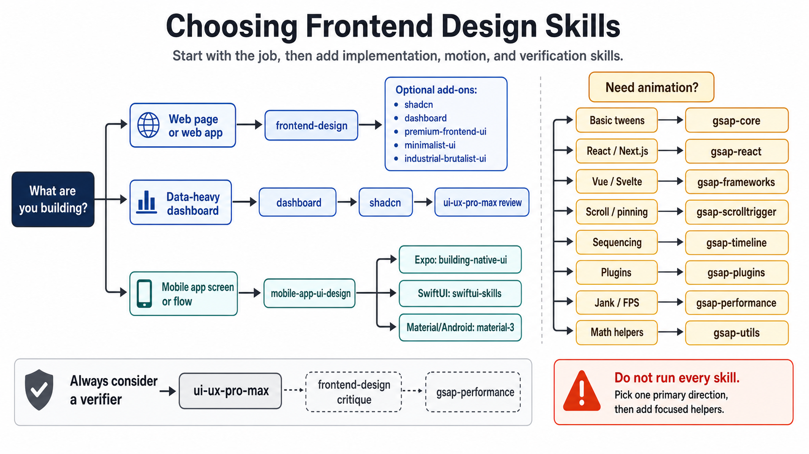

# Claude Design Skills

A practical user guide and decision map for the **frontend design skills** you can install into Claude Code (and compatible agents). It explains *when* to reach for each skill and *how* to ask for it effectively, so you pick the right building block instead of guessing.

## Contents

- **[frontend-design-skills-user-guide.md](frontend-design-skills-user-guide.md)** — the full guide: skill mental model, a quick decision table, and how to phrase requests.
- **frontend-skill-decision-map.png** — the visual decision map (below).

## Decision map

## Credit

Based on the walkthrough in this YouTube video: <https://www.youtube.com/watch?v=Ot582-E61ac>
